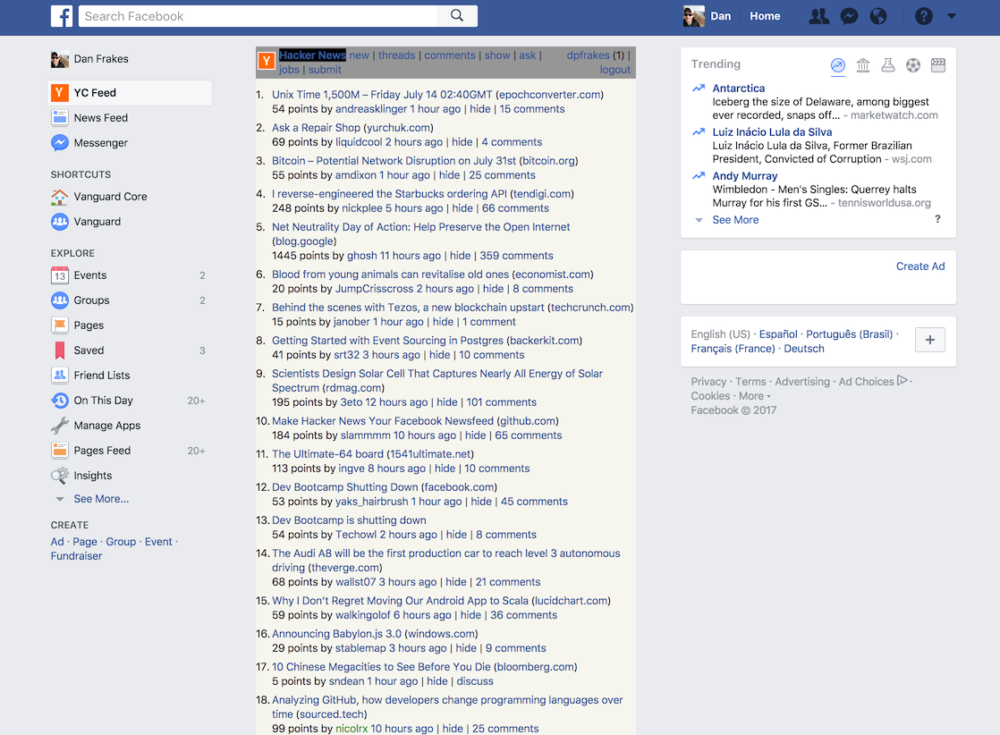
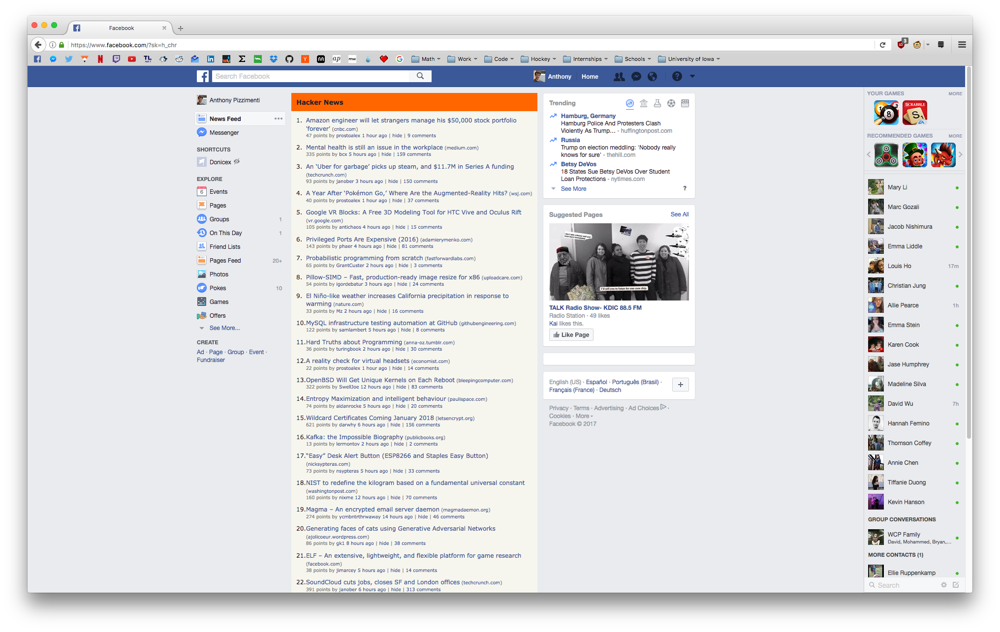

# hackernews-newsfeed
Sick of your ad-ridden Facebook newsfeed? Convert it to Hacker News!

This extension removes your Facebook newsfeed and replaces it with Hacker News.

# Installation
## Chrome
hackernews-newsfeed can be installed on the chrome webstore [here](https://chrome.google.com/webstore/detail/convert-facebook-newsfeed/edcoflgjlemkndaenboobeccnnlnondj).

Or you can clone this repo and upload the folder to chrome extensions at chrome://extensions/.
```
git clone https://github.com/yczeng/hackernews-newsfeed
```


## Firefox/Greasemonkey/Tampermonkey
If you have Firefox, install [Greasemonkey](https://addons.mozilla.org/en-US/firefox/addon/greasemonkey/),
the friendly user-script injection service. 

[You can install from greasyfork](https://greasyfork.org/en/scripts/31209-hackernews-feed), the
Greasemonkey/Tampermonkey/*monkey hosting service. Then just click the link to install the script,
and you're good to go.

If you don't want to do the above option, you can do stuff the hard way. 

1. Go to Firefox's [addon page](about:addons)

2. Go to Greasemonkey (or *User Scripts*), and click **New User Script...**

3. Name it whatever you want, provide your email as the Domain, and click **Done**.

4. Edit the script, and paste the contents of `greasemonkey.js` in, and click save.

5. Click on **Preferences**, **User Settings**, and then **Add** included pages.

6. Enter `https://www.facebook.com/*`, then click *OK*, and *OK* again.

7. fin.



# FAQ
### Why make this?
I'm hopelessly addicted to Facebook and the only way to curb my addiction is by replacing my newsfeed with something equally addictive, like Hacker News.

### Why is the Chrome extension different from the Firefox extension?
I use Chrome so I built the extension for myself in Chrome. [apizzimenti](https://github.com/apizzimenti) saw my project on Github, thought it was a good idea, and sent a pull request with a Firefox implementation.

### Why does the Chrome extension cover the entire Facebook newsfeed?
I don't want shortcuts to help me spend more time on Facebook.

### What can I do?
Right now the Hacker News css of the Chrome extension is changing the text on the right part of the search bar gray. If you can separate the Facebook css from the Hacker News css, feel free to send a pull request.

### Is this a joke?
yes

# License
hackernews-newsfeed is available under the MIT license. See `LICENSE` file in the repository.
